 

# PIC18F Q10 Data Streamer Driver Use-case example with Sendflag

This example is the full code listing for the sendflag example use-case from the in the MCC Melody - [Data Streamer Driver Reference](https://onlinedocs.microchip.com/v2/keyword-lookup?keyword=DATA-STREAMER-DRIVER&version=latest&redirect=true). 

The [MPLAB Data Visualizer](https://onlinedocs.microchip.com/v2/keyword-lookup?keyword=MPLAB_DATA_VISUALIZER&version=latest&redirect=true) can directly plot 8-bit hex values, received from an embedded application. [Variable Streamers](https://onlinedocs.microchip.com/v2/keyword-lookup?keyword=MDV:VARIABLE_STREAMERS&version=latest&redirect=true) are supported by the MPLAB Data Visualizer, to display these variables on a graph (or custom dashboard). To do this such as the embedded application must send these variables using the Stream Format (found in Variable Streamers), a light-weight framing format to pack several numerical values over one interface. 

## Software Used

- MPLAB® X IDE 5.50.0 or newer [(MPLAB® X IDE 5.50)](https://www.microchip.com/en-us/development-tools-tools-and-software/mplab-x-ide?utm_source=GitHub&utm_medium=TextLink&utm_campaign=MCU8_MMTCha_MPAE_Examples&utm_content=pic18f16q41-cnano-data-streamer-driver-mplab-mcc-github)
- MPLAB® XC8 2.30.0 or newer compiler [(MPLAB® XC8 2.30)](https://www.microchip.com/en-us/development-tools-tools-and-software/mplab-xc-compilers?utm_source=GitHub&utm_medium=TextLink&utm_campaign=MCU8_MMTCha_MPAE_Examples&utm_content=pic18f16q41-cnano-data-streamer-driver-mplab-mcc-github)
- MCC Melody 1.84.5 or newer
## Hardware Used

- PIC18F47Q10 Curiosity Nano [(DM182029)](https://www.microchip.com/Developmenttools/ProductDetails/DM182029)

## Setup

The Data Streamer Driver, when opened in MCC Melody, and selected in the MCC Builder, should have the following settings. 

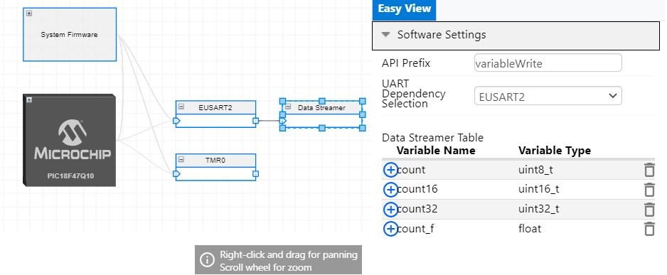

## Setup Data Visualizer Workspace
Follow these steps to learn how to setup a Data Visualizer workspace, or skip to the next section to simply open the workspace. 

Compile and program the project. Open the Data Visualizer by clicking the Data Visualizer Icon 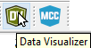

The LED on the board should be toggling at 100ms. 
With the LED the project also toggles a Debug GPIO on our board (PIC18F47Q10 Curiosity Nano). You can verify that this is toggling by Plotting all Debug GPIO pins. 

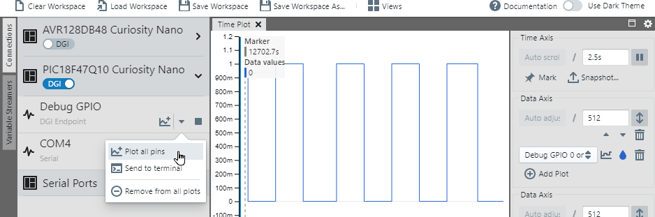

Similarly, you can click to Start Streaming, on the relevant virtual com port associated with your board (PIC18F47Q10 Curiosity Nano).

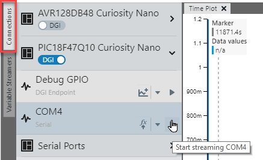

Then, Send to Terminal, selecting Display as *Hex Values*. This should enable you to see a Data Streamer Frame, bounded by 0x03 as the Start Byte and 0xFC as the End Byte. 

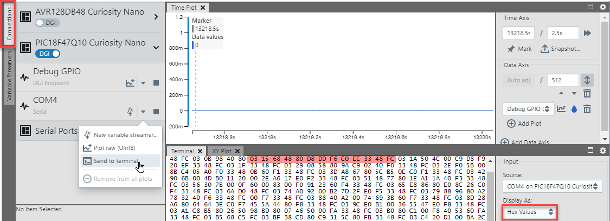

Next you'll be able to set up graphs for the variables that were defined in the Data Streamer Driver.
Click on the Variable Streamers tab then open Variable Streamer. 

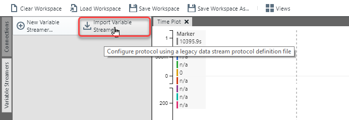

Navigate to the the .ds file, generated by MCC Melody, based on the variables configured in the Data Streamer Driver.
../mcc_generated_files/data_streamer/data_streamer.ds

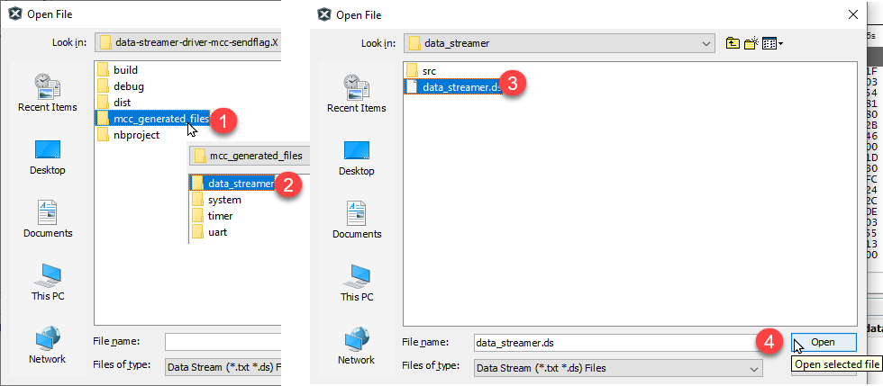

After clicking Open, you should see the following variables imported. 

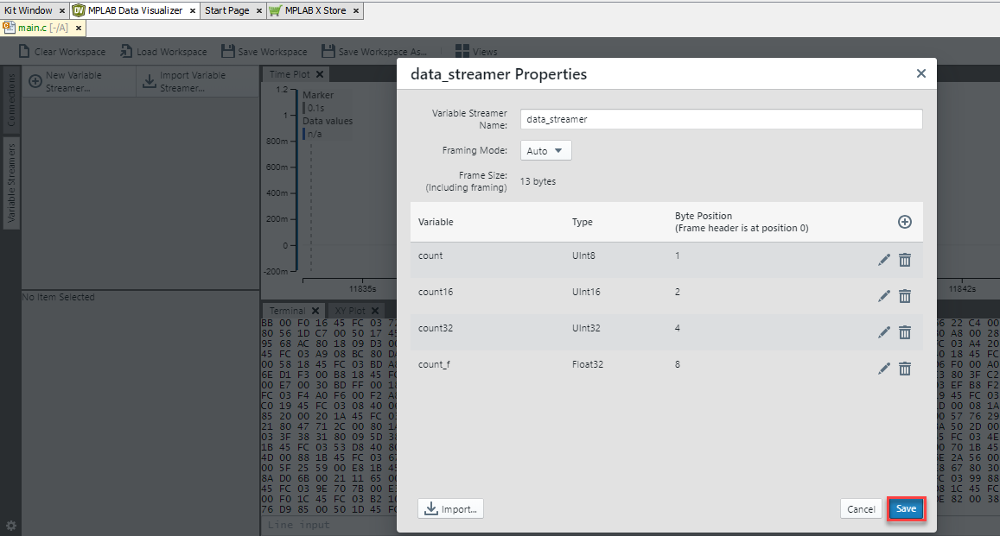

If you have connected a suitable data source (Connections Tab), you can now select a source for the configured variable streamer.

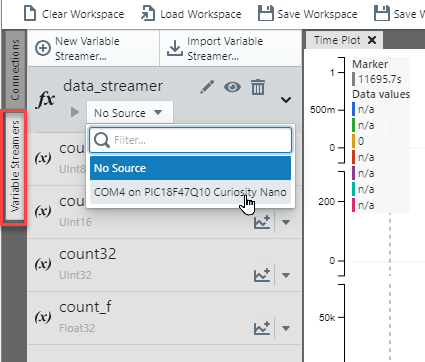

Add 4 axes to your project, one for each of the variables that were configured in the Data Streamer Driver. 

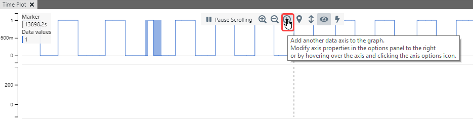

You can now assign the variables to axes by 
1) clicking *Axis Options*
2) Adding a plot to the axis and 
3) Selecting a variable to plot on the axes

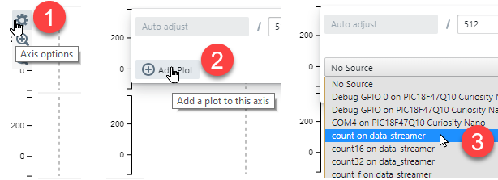

The Data Visualizer output should now look as follows. You can save the DV workspace, so that you won't have to set it up again if you close the Data Visualizer.  

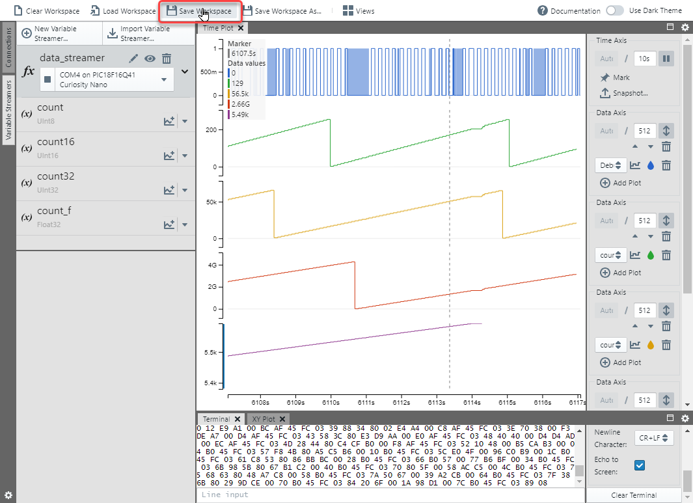

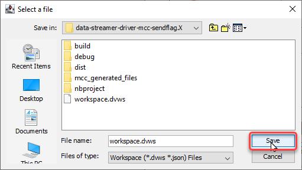

## Open Data Visualizer Workspace
The previous section describes how to set up a workspace. A workspace file was also added to the project, which can be opened directly. 

Start Streaming for both Debug GPIO and the relevant COM port. 

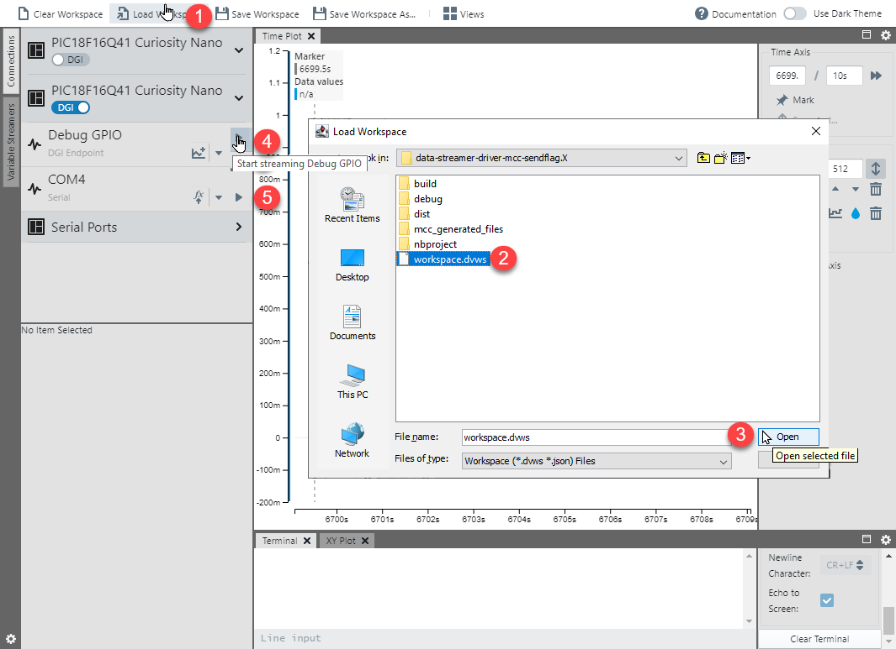

NOTE: The Data Visualizer Workspace File (.dvws) saves even the specific kit. So, you will also need to select the source from on the Variable Streamer tab. 

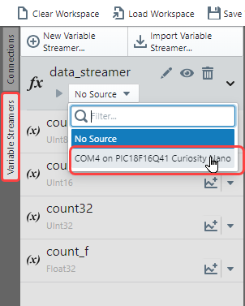

## Summary

Once you have added the relevant variables to the axes as described above, the following should be the result. 

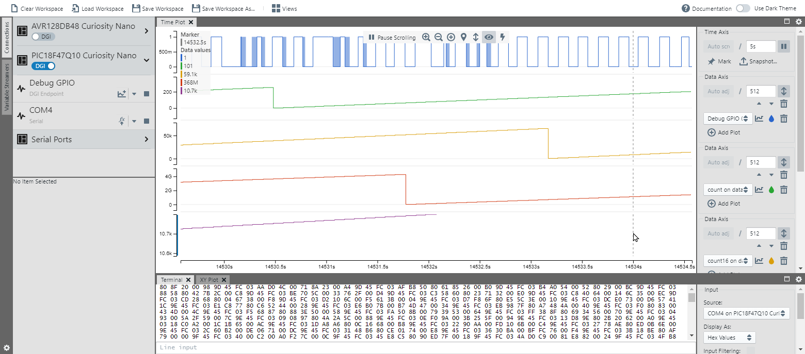

