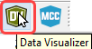
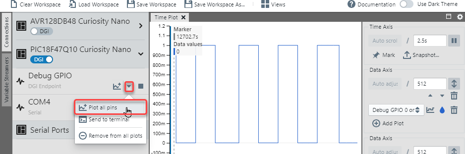
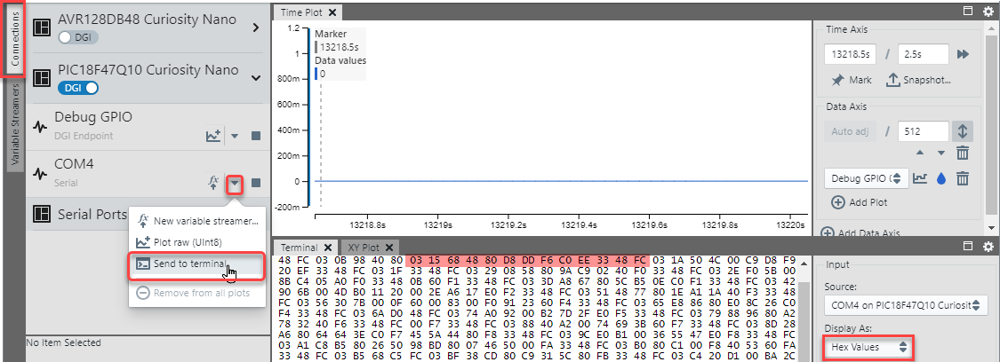

<!-- Please do not change this logo with link -->

# Data Streamer Driver Use-case example with Sendflag

<!-- This is where the introduction to the example goes, including mentioning the peripherals used -->

## Related Documentation

This example is the full code listing for the sendflag example use-case from the in the MCC Melody - [Data Streamer Driver Reference](https://onlinedocs.microchip.com/v2/keyword-lookup?keyword=DATA-STREAMER-DRIVER&version=latest&redirect=true). 

The [MPLAB Data Visualizer](https://onlinedocs.microchip.com/v2/keyword-lookup?keyword=MPLAB_DATA_VISUALIZER&version=latest&redirect=true) can directly plot 8-bit hex values, received from an embedded application. [Variable Streamers](https://onlinedocs.microchip.com/v2/keyword-lookup?keyword=MDV:VARIABLE_STREAMERS&version=latest&redirect=true) are supported by the MPLAB Data Visualizer, to display these variables on a graph (or custom dashboard). To do this such as the embedded application must send these variables using the Stream Format (found in Variable Streamers), a light-weight framing format to pack several numerical values over one interface. 

<!-- Any information about an application note or tech brief can be linked here. Use unbreakable links!
     In addition a link to the device family landing page and relevant peripheral pages as well:
     - [AN3381 - Brushless DC Fan Speed Control Using Temperature Input and Tachometer Feedback](https://microchip.com/00003381/)
     - [PIC18F-Q10 Family Product Page](https://www.microchip.com/design-centers/8-bit/pic-mcus/device-selection/pic18f-q10-product-family) -->

## Software Used

<!-- All software used in this example must be listed here. Use unbreakable links!
     - MPLAB® X IDE 5.30 or newer [(microchip.com/mplab/mplab-x-ide)](http://www.microchip.com/mplab/mplab-x-ide)
     - MPLAB® XC8 2.10 or a newer compiler [(microchip.com/mplab/compilers)](http://www.microchip.com/mplab/compilers)
     - MPLAB® Code Configurator (MCC) 3.95.0 or newer [(microchip.com/mplab/mplab-code-configurator)](https://www.microchip.com/mplab/mplab-code-configurator)
     - MPLAB® Code Configurator (MCC) Device Libraries PIC10 / PIC12 / PIC16 / PIC18 MCUs [(microchip.com/mplab/mplab-code-configurator)](https://www.microchip.com/mplab/mplab-code-configurator)
     - Microchip PIC18F-Q Series Device Support (1.4.109) or newer [(packs.download.microchip.com/)](https://packs.download.microchip.com/) -->

- MPLAB® X IDE 5.50.0 or newer [(MPLAB® X IDE 5.50)](https://www.microchip.com/en-us/development-tools-tools-and-software/mplab-x-ide?utm_source=GitHub&utm_medium=TextLink&utm_campaign=MCU8_MMTCha_MPAE_Examples&utm_content=pic18f16q41-cnano-data-streamer-driver-mplab-mcc-github)
- MPLAB® XC8 2.30.0 or newer compiler [(MPLAB® XC8 2.30)](https://www.microchip.com/en-us/development-tools-tools-and-software/mplab-xc-compilers?utm_source=GitHub&utm_medium=TextLink&utm_campaign=MCU8_MMTCha_MPAE_Examples&utm_content=pic18f16q41-cnano-data-streamer-driver-mplab-mcc-github)
- MCC Melody 1.84.5 or newer
## Hardware Used

- PIC18F47Q10 Curiosity Nano [(DM182029)](https://www.microchip.com/Developmenttools/ProductDetails/DM182029)

<!-- All hardware used in this example must be listed here. Use unbreakable links!
     - PIC18F47Q10 Curiosity Nano [(DM182029)](https://www.microchip.com/Developmenttools/ProductDetails/DM182029)
     - Curiosity Nano Base for Click boards™ [(AC164162)](https://www.microchip.com/Developmenttools/ProductDetails/AC164162)
     - POT Click board™ [(MIKROE-3402)](https://www.mikroe.com/pot-click) -->

## Setup

<!-- Explain how to connect hardware and set up software. Depending on complexity, step-by-step instructions and/or tables and/or images can be used -->
The Data Streamer Driver, when opened in MCC Melody, and selected in the MCC Buider, should have the following settings. 

## Operation

Compile and program the project. Open the Data Visualizer by clicking the Data Visualizer Icon 

The LED on the board should be toggling at 100ms. 
With the LED the project also toggles a Debug GPIO on our board (PIC18F47Q10 Curiosity Nano). You can verify that this is toggling by Plotting all Debug GPIO pins. 

Similarly, you can click to Start Streaming, on the relevant virtual com port associated with your board (PIC18F47Q10 Curiosity Nano).

Then, Send to Terminal, selecting Display as *Hex Values*. This should enable you to see a Data Streamer Frame, bounded by 0x03 as the Start Byte and 0xFC as the End Byte. 

Next you'll be able to set up graphs for the variables that were defined in the Data Streamer Driver.
Click on the Variable Streamers tab then open Variable Streamer. 

Navigate to the the .ds file, generated by MCC Melody, based on the variables configured in the Data Streamer Driver.
../mcc_generated_files/data_streamer/data_streamer.ds

After clicking Open, you should see the following variables imported. 

If you have connected a suitable data source (Connections Tab), you can now select a source for the configured variable streamer.

Add 4 axes to your project, one for each of the variables that were configured in the Data Streamer Driver. 

You can now assign the variables to axes by 
1) clicking *Axis Options*
2) Adding a plot to the axis and 
3) Selecting a variable to plot on the axes

<!-- Explain how to operate the example. Depending on complexity, step-by-step instructions and/or tables and/or images can be used -->

## Summary

Once you have added the relevant variables to the axes as described above, the following should be the result. 

<!-- Summarize what the example has shown -->
